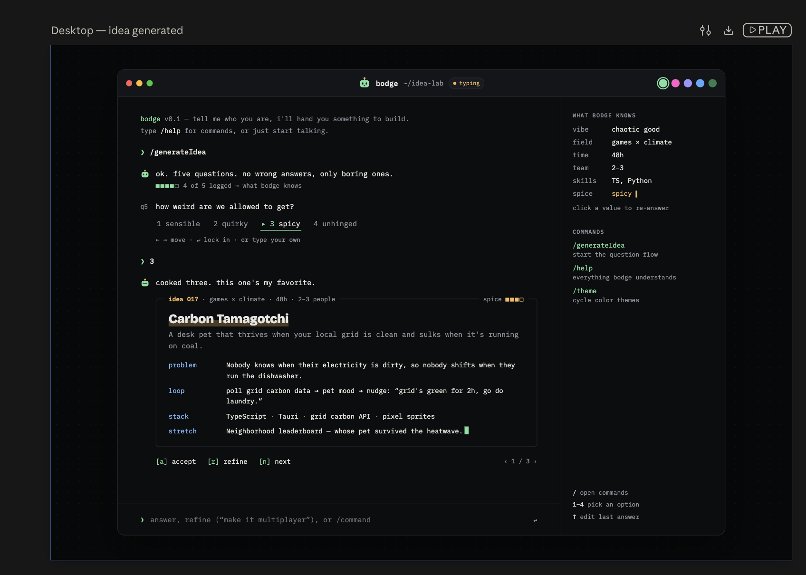
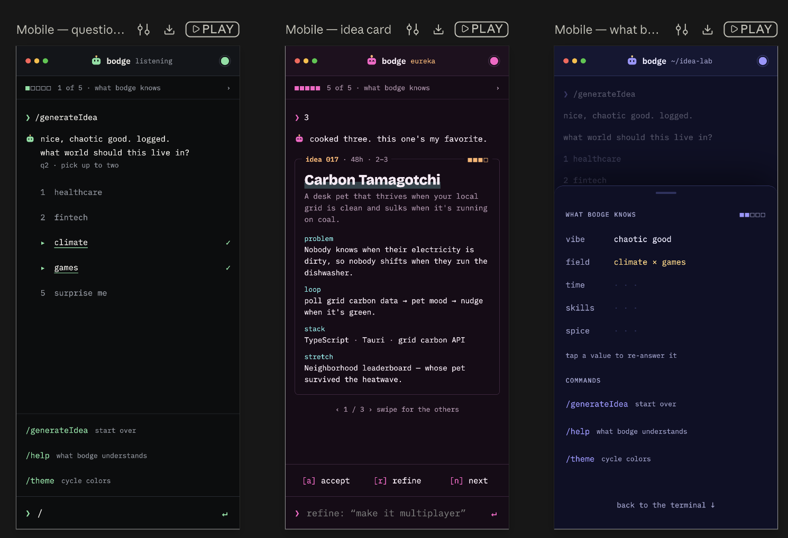

# Bodge

A terminal-style project idea generator for builders and hackathon teams. Planning is underway; application code has not been started.

GitHub repository: [devonwallerson/bodge](https://github.com/devonwallerson/bodge) (public).

## Design renderings

These uploaded renderings are committed in this repository and are the visual reference for implementation.

**Desktop** — [open full image](docs/reference/design/bodge-desktop.png)

**Mobile** — [open full image](docs/reference/design/bodge-mobile.png)

## Build documents

- [Living feasibility and product specification](docs/FEASIBILITY.md)
- [Acceptance criteria](docs/ACCEPTANCE_CRITERIA.md)
- [Implementation runbook](docs/IMPLEMENTATION_RUNBOOK.md)
- [Start here for a new coding agent](docs/IMPLEMENTATION_HANDOFF.md)
- [50-question bank and selection rules](docs/QUESTION_BANK.md)
- [Desktop design reference](docs/reference/design/bodge-desktop.png)
- [Mobile design reference](docs/reference/design/bodge-mobile.png)
- [Original Claude feasibility](docs/reference/source/claude-feasibility.txt)
- [Original Claude acceptance plan](docs/reference/source/claude-acceptance-criteria.txt)

The renderings guide the UI. The living plan records current scope and resolves differences between earlier drafts.
